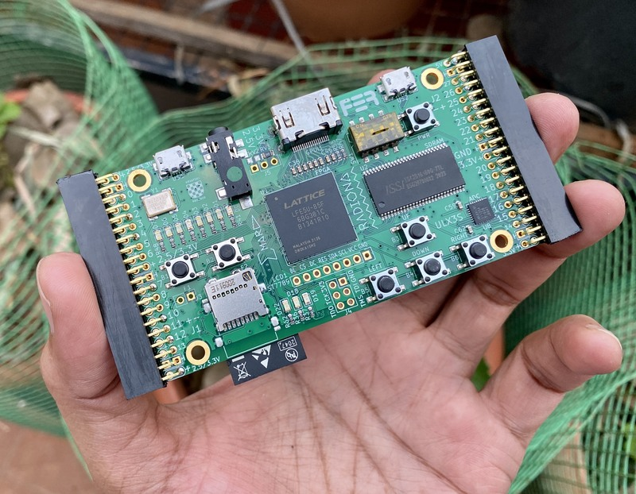

# ULX3S Examples

Beginner-friendly Verilog based examples for the Lattice ECP5 based 
ULX3S FPGA board from Radiona Labs.

## Toolchain Installation 

Get the OSS CAD suite here:

https://github.com/YosysHQ/oss-cad-suite-build/releases/

These examples were tested on Windows 10 with Ubuntu Linux installed on WSL2. 

To use the Makefile on Linux, change `fujprog.exe` to `fujprog`.

## List of Examples 

|Date Added | Name | Difficulty | Description |
|-----------| ---- | ---------- | ----------- |
|10 Apr 2022 | [vga_bram][2]| Easy | Displays image on VGA using block RAM.|
|08 Apr 2022 | [vga_hello][1]| Easy | A simple VGA pattern generator.|

[1]: https://github.com/mkvenkit/ulx3s_examples/tree/main/vga_hello
[2]: https://github.com/mkvenkit/ulx3s_examples/tree/main/vga_bram

