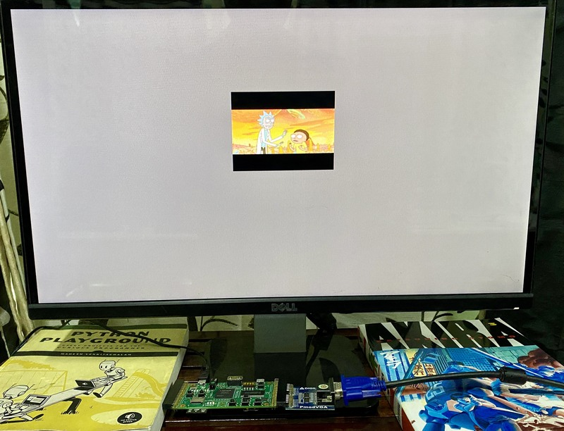
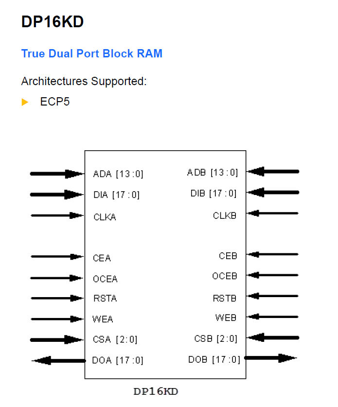

## VGA BRAM 



This example displays a 128 x 128 image using VGA. A Python script is provided 
which resizes the input image and creates a hex file which can be used to 
initialize the block RAM. (We use 12-bit RGB color.)

## Inferring BRAM 

For sythesis to automatically infer BRAM, we need to access the memory in a 
careful way. This is discussed in detail in the article below:

https://zipcpu.com/tutorial/lsn-08-memory.pdf

If you infer BRAM correctly, you will see this in the next-pnr output:

```
Info: Device utilisation:
Info: 	       TRELLIS_SLICE:   162/41820     0%
Info: 	          TRELLIS_IO:    23/  365     6%
Info: 	                DCCA:     1/   56     1%
Info: 	              DP16KD:    12/  208     5%
Info: 	          MULT18X18D:     0/  156     0%
Info: 	              ALU54B:     0/   78     0%
Info: 	             EHXPLLL:     0/    4     0%
Info: 	             EXTREFB:     0/    2     0%
Info: 	                DCUA:     0/    2     0%
Info: 	           PCSCLKDIV:     0/    2     0%
Info: 	             IOLOGIC:     0/  224     0%
Info: 	            SIOLOGIC:     0/  141     0%
Info: 	                 GSR:     0/    1     0%
Info: 	               JTAGG:     0/    1     0%
Info: 	                OSCG:     0/    1     0%
Info: 	               SEDGA:     0/    1     0%
Info: 	                 DTR:     0/    1     0%
Info: 	             USRMCLK:     0/    1     0%
Info: 	             CLKDIVF:     0/    4     0%
Info: 	           ECLKSYNCB:     0/   10     0%
Info: 	             DLLDELD:     0/    8     0%
Info: 	              DDRDLL:     0/    4     0%
Info: 	             DQSBUFM:     0/   14     0%
Info: 	     TRELLIS_ECLKBUF:     0/    8     0%
Info: 	        ECLKBRIDGECS:     0/    2     0%
Info: 	                DCSC:     0/    2     0%
```

`DP16KD` (True Dual Port Block RAM) is what we're looking for. Here's the 
module from Lattice documentation:



## LPF changes 

This example uses the Digilent VGA PMOD. Connect it as shown in the photo above, 
and make the following changes in the LPF file.


```
391c391
< LOCATE COMP "gn[14]" SITE "U17"; # J2_5-  GN14
---
> LOCATE COMP "G[3]" SITE "U17"; # J2_5-  GN14
393,397c393,397
< LOCATE COMP "gn[15]" SITE "P16"; # J2_7-  GN15
< LOCATE COMP "gp[16]" SITE "N16"; # J2_9+  GP16
< LOCATE COMP "gn[16]" SITE "M17"; # J2_9-  GN16
< LOCATE COMP "gp[17]" SITE "L16"; # J2_11+ GP17
< LOCATE COMP "gn[17]" SITE "L17"; # J2_11- GN17
---
> LOCATE COMP "G[2]" SITE "P16"; # J2_7-  GN15
> LOCATE COMP "vsync" SITE "N16"; # J2_9+  GP16
> LOCATE COMP "G[1]" SITE "M17"; # J2_9-  GN16
> LOCATE COMP "hsync" SITE "L16"; # J2_11+ GP17
> LOCATE COMP "G[0]" SITE "L17"; # J2_11- GN17
405c405
< IOBUF PORT  "gn[14]" PULLMODE=UP IO_TYPE=LVCMOS33 DRIVE=4;
---
> IOBUF PORT  "G[3]" PULLMODE=UP IO_TYPE=LVCMOS33 DRIVE=4;
407,411c407,411
< IOBUF PORT  "gn[15]" PULLMODE=UP IO_TYPE=LVCMOS33 DRIVE=4;
< IOBUF PORT  "gp[16]" PULLMODE=UP IO_TYPE=LVCMOS33 DRIVE=4;
< IOBUF PORT  "gn[16]" PULLMODE=UP IO_TYPE=LVCMOS33 DRIVE=4;
< IOBUF PORT  "gp[17]" PULLMODE=UP IO_TYPE=LVCMOS33 DRIVE=4;
< IOBUF PORT  "gn[17]" PULLMODE=UP IO_TYPE=LVCMOS33 DRIVE=4;
---
> IOBUF PORT  "G[2]" PULLMODE=UP IO_TYPE=LVCMOS33 DRIVE=4;
> IOBUF PORT  "vsync" PULLMODE=UP IO_TYPE=LVCMOS33 DRIVE=4; # GP16
> IOBUF PORT  "G[1]" PULLMODE=UP IO_TYPE=LVCMOS33 DRIVE=4;
> IOBUF PORT  "hsync" PULLMODE=UP IO_TYPE=LVCMOS33 DRIVE=4; # GP17
> IOBUF PORT  "G[0]" PULLMODE=UP IO_TYPE=LVCMOS33 DRIVE=4;
418,425c418,425
< LOCATE COMP "gp[21]" SITE "C18"; # J2_23+ GP21
< LOCATE COMP "gn[21]" SITE "D17"; # J2_23- GN21
< LOCATE COMP "gp[22]" SITE "B15"; # J2_25+ GP22 D15->B15
< LOCATE COMP "gn[22]" SITE "C15"; # J2_25- GN22 E15->C15
< LOCATE COMP "gp[23]" SITE "B17"; # J2_27+ GP23
< LOCATE COMP "gn[23]" SITE "C17"; # J2_27- GN23
< LOCATE COMP "gp[24]" SITE "C16"; # J2_29+ GP24
< LOCATE COMP "gn[24]" SITE "D16"; # J2_29- GN24
---
> LOCATE COMP "B[3]" SITE "C18"; # J2_23+ GP21
> LOCATE COMP "R[3]" SITE "D17"; # J2_23- GN21
> LOCATE COMP "B[2]" SITE "B15"; # J2_25+ GP22 D15->B15
> LOCATE COMP "R[2]" SITE "C15"; # J2_25- GN22 E15->C15
> LOCATE COMP "B[1]" SITE "B17"; # J2_27+ GP23
> LOCATE COMP "R[1]" SITE "C17"; # J2_27- GN23
> LOCATE COMP "B[0]" SITE "C16"; # J2_29+ GP24
> LOCATE COMP "R[0]" SITE "D16"; # J2_29- GN24
432,439c432,439
< IOBUF PORT  "gp[21]" PULLMODE=UP IO_TYPE=LVCMOS33 DRIVE=4;
< IOBUF PORT  "gn[21]" PULLMODE=UP IO_TYPE=LVCMOS33 DRIVE=4;
< IOBUF PORT  "gp[22]" PULLMODE=UP IO_TYPE=LVCMOS33 DRIVE=4;
< IOBUF PORT  "gn[22]" PULLMODE=UP IO_TYPE=LVCMOS33 DRIVE=4;
< IOBUF PORT  "gp[23]" PULLMODE=UP IO_TYPE=LVCMOS33 DRIVE=4;
< IOBUF PORT  "gn[23]" PULLMODE=UP IO_TYPE=LVCMOS33 DRIVE=4;
< IOBUF PORT  "gp[24]" PULLMODE=UP IO_TYPE=LVCMOS33 DRIVE=4;
< IOBUF PORT  "gn[24]" PULLMODE=UP IO_TYPE=LVCMOS33 DRIVE=4;
---
> IOBUF PORT  "B[3]" PULLMODE=UP IO_TYPE=LVCMOS33 DRIVE=4;
> IOBUF PORT  "R[3]" PULLMODE=UP IO_TYPE=LVCMOS33 DRIVE=4;
> IOBUF PORT  "B[2]" PULLMODE=UP IO_TYPE=LVCMOS33 DRIVE=4;
> IOBUF PORT  "R[2]" PULLMODE=UP IO_TYPE=LVCMOS33 DRIVE=4;
> IOBUF PORT  "B[1]" PULLMODE=UP IO_TYPE=LVCMOS33 DRIVE=4;
> IOBUF PORT  "R[1]" PULLMODE=UP IO_TYPE=LVCMOS33 DRIVE=4;
> IOBUF PORT  "B[0]" PULLMODE=UP IO_TYPE=LVCMOS33 DRIVE=4;
> IOBUF PORT  "R[0]" PULLMODE=UP IO_TYPE=LVCMOS33 DRIVE=4;
```
