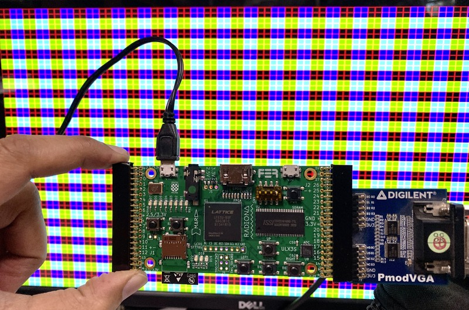

## VGA Hello 

Simple VGA out example on the ECP5 ULX3S FPGA board.



## VGA Spec

VGA Signal 640 x 480 @ 60 Hz Industry standard timing

http://tinyvga.com/vga-timing/640x480@60Hz


## LPF changes 

This example uses the Digilent VGA PMOD. Connect it as shown in the photo above, 
and make the following changes in the LPF file.


```
391c391
< LOCATE COMP "gn[14]" SITE "U17"; # J2_5-  GN14
---
> LOCATE COMP "G[3]" SITE "U17"; # J2_5-  GN14
393,397c393,397
< LOCATE COMP "gn[15]" SITE "P16"; # J2_7-  GN15
< LOCATE COMP "gp[16]" SITE "N16"; # J2_9+  GP16
< LOCATE COMP "gn[16]" SITE "M17"; # J2_9-  GN16
< LOCATE COMP "gp[17]" SITE "L16"; # J2_11+ GP17
< LOCATE COMP "gn[17]" SITE "L17"; # J2_11- GN17
---
> LOCATE COMP "G[2]" SITE "P16"; # J2_7-  GN15
> LOCATE COMP "vsync" SITE "N16"; # J2_9+  GP16
> LOCATE COMP "G[1]" SITE "M17"; # J2_9-  GN16
> LOCATE COMP "hsync" SITE "L16"; # J2_11+ GP17
> LOCATE COMP "G[0]" SITE "L17"; # J2_11- GN17
405c405
< IOBUF PORT  "gn[14]" PULLMODE=UP IO_TYPE=LVCMOS33 DRIVE=4;
---
> IOBUF PORT  "G[3]" PULLMODE=UP IO_TYPE=LVCMOS33 DRIVE=4;
407,411c407,411
< IOBUF PORT  "gn[15]" PULLMODE=UP IO_TYPE=LVCMOS33 DRIVE=4;
< IOBUF PORT  "gp[16]" PULLMODE=UP IO_TYPE=LVCMOS33 DRIVE=4;
< IOBUF PORT  "gn[16]" PULLMODE=UP IO_TYPE=LVCMOS33 DRIVE=4;
< IOBUF PORT  "gp[17]" PULLMODE=UP IO_TYPE=LVCMOS33 DRIVE=4;
< IOBUF PORT  "gn[17]" PULLMODE=UP IO_TYPE=LVCMOS33 DRIVE=4;
---
> IOBUF PORT  "G[2]" PULLMODE=UP IO_TYPE=LVCMOS33 DRIVE=4;
> IOBUF PORT  "vsync" PULLMODE=UP IO_TYPE=LVCMOS33 DRIVE=4; # GP16
> IOBUF PORT  "G[1]" PULLMODE=UP IO_TYPE=LVCMOS33 DRIVE=4;
> IOBUF PORT  "hsync" PULLMODE=UP IO_TYPE=LVCMOS33 DRIVE=4; # GP17
> IOBUF PORT  "G[0]" PULLMODE=UP IO_TYPE=LVCMOS33 DRIVE=4;
418,425c418,425
< LOCATE COMP "gp[21]" SITE "C18"; # J2_23+ GP21
< LOCATE COMP "gn[21]" SITE "D17"; # J2_23- GN21
< LOCATE COMP "gp[22]" SITE "B15"; # J2_25+ GP22 D15->B15
< LOCATE COMP "gn[22]" SITE "C15"; # J2_25- GN22 E15->C15
< LOCATE COMP "gp[23]" SITE "B17"; # J2_27+ GP23
< LOCATE COMP "gn[23]" SITE "C17"; # J2_27- GN23
< LOCATE COMP "gp[24]" SITE "C16"; # J2_29+ GP24
< LOCATE COMP "gn[24]" SITE "D16"; # J2_29- GN24
---
> LOCATE COMP "B[3]" SITE "C18"; # J2_23+ GP21
> LOCATE COMP "R[3]" SITE "D17"; # J2_23- GN21
> LOCATE COMP "B[2]" SITE "B15"; # J2_25+ GP22 D15->B15
> LOCATE COMP "R[2]" SITE "C15"; # J2_25- GN22 E15->C15
> LOCATE COMP "B[1]" SITE "B17"; # J2_27+ GP23
> LOCATE COMP "R[1]" SITE "C17"; # J2_27- GN23
> LOCATE COMP "B[0]" SITE "C16"; # J2_29+ GP24
> LOCATE COMP "R[0]" SITE "D16"; # J2_29- GN24
432,439c432,439
< IOBUF PORT  "gp[21]" PULLMODE=UP IO_TYPE=LVCMOS33 DRIVE=4;
< IOBUF PORT  "gn[21]" PULLMODE=UP IO_TYPE=LVCMOS33 DRIVE=4;
< IOBUF PORT  "gp[22]" PULLMODE=UP IO_TYPE=LVCMOS33 DRIVE=4;
< IOBUF PORT  "gn[22]" PULLMODE=UP IO_TYPE=LVCMOS33 DRIVE=4;
< IOBUF PORT  "gp[23]" PULLMODE=UP IO_TYPE=LVCMOS33 DRIVE=4;
< IOBUF PORT  "gn[23]" PULLMODE=UP IO_TYPE=LVCMOS33 DRIVE=4;
< IOBUF PORT  "gp[24]" PULLMODE=UP IO_TYPE=LVCMOS33 DRIVE=4;
< IOBUF PORT  "gn[24]" PULLMODE=UP IO_TYPE=LVCMOS33 DRIVE=4;
---
> IOBUF PORT  "B[3]" PULLMODE=UP IO_TYPE=LVCMOS33 DRIVE=4;
> IOBUF PORT  "R[3]" PULLMODE=UP IO_TYPE=LVCMOS33 DRIVE=4;
> IOBUF PORT  "B[2]" PULLMODE=UP IO_TYPE=LVCMOS33 DRIVE=4;
> IOBUF PORT  "R[2]" PULLMODE=UP IO_TYPE=LVCMOS33 DRIVE=4;
> IOBUF PORT  "B[1]" PULLMODE=UP IO_TYPE=LVCMOS33 DRIVE=4;
> IOBUF PORT  "R[1]" PULLMODE=UP IO_TYPE=LVCMOS33 DRIVE=4;
> IOBUF PORT  "B[0]" PULLMODE=UP IO_TYPE=LVCMOS33 DRIVE=4;
> IOBUF PORT  "R[0]" PULLMODE=UP IO_TYPE=LVCMOS33 DRIVE=4;
```
